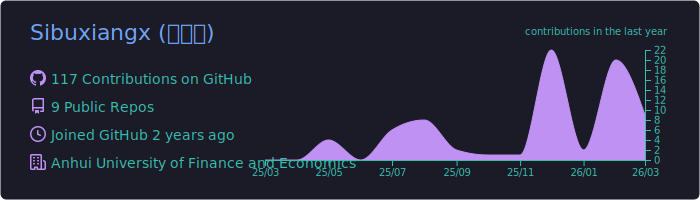
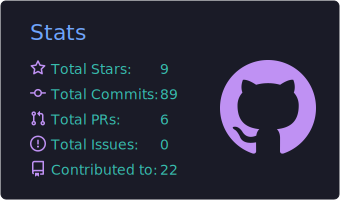
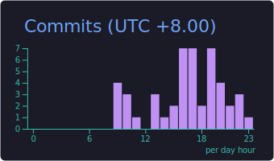
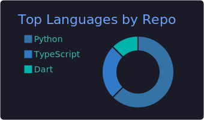
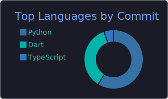

  <!-- 动态打字效果 -->
  

   

  <em>🌧️ 雨霖新叶久不晴 人念旧识长悲思</em>

    

  <!-- 访客计数 -->
  

---

### 🧑‍💻 关于我

> 🚀 **是有兽焉四不像的厨子，这样**

- 🐍 会一点点 Python 和 JS/TS
- 💻 VSCode · Neovim 用户
- 📝 写文档很慢，但在努力
- ✨ 有灵感和时间会写点 IM Bot 或者一些没用的小工具
- 📚 安徽财经大学
- 🔍 找到工作再说

---

### 🛠️ 技术栈

  
  
  
  
  
   
  
  
  
  
  

---

### 📊 GitHub 统计

  <!-- Profile Details -->
  <picture>
    <source media="(prefers-color-scheme: dark)" srcset="./profile-summary-card-output/tokyonight/0-profile-details.svg" />
    <source media="(prefers-color-scheme: light)" srcset="./profile-summary-card-output/default/0-profile-details.svg" />
    
  </picture>

   

  <!-- Stats + Productive Time -->
  <picture>
    <source media="(prefers-color-scheme: dark)" srcset="./profile-summary-card-output/tokyonight/3-stats.svg" />
    <source media="(prefers-color-scheme: light)" srcset="./profile-summary-card-output/default/3-stats.svg" />
    
  </picture>
  <picture>
    <source media="(prefers-color-scheme: dark)" srcset="./profile-summary-card-output/tokyonight/4-productive-time.svg" />
    <source media="(prefers-color-scheme: light)" srcset="./profile-summary-card-output/default/4-productive-time.svg" />
    
  </picture>

   

  <!-- Language Cards -->
  <picture>
    <source media="(prefers-color-scheme: dark)" srcset="./profile-summary-card-output/tokyonight/1-repos-per-language.svg" />
    <source media="(prefers-color-scheme: light)" srcset="./profile-summary-card-output/default/1-repos-per-language.svg" />
    
  </picture>
  <picture>
    <source media="(prefers-color-scheme: dark)" srcset="./profile-summary-card-output/tokyonight/2-most-commit-language.svg" />
    <source media="(prefers-color-scheme: light)" srcset="./profile-summary-card-output/default/2-most-commit-language.svg" />
    
  </picture>

   

  <!-- Streak Stats -->
  

---

### 🐍 贡献贪吃蛇

  <picture>
    <source media="(prefers-color-scheme: dark)" srcset="https://raw.githubusercontent.com/Sibuxiangx/Sibuxiangx/output/github-contribution-grid-snake-dark.svg" />
    <source media="(prefers-color-scheme: light)" srcset="https://raw.githubusercontent.com/Sibuxiangx/Sibuxiangx/output/github-contribution-grid-snake.svg" />
    
  </picture>

---

  <em>Aufer</em>

