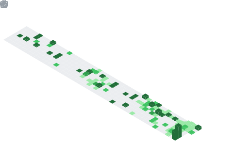
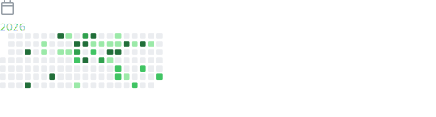

  <!-- Animated Typing Header -->
  

   

  <em>🌧️ 雨霖新叶久不晴 人念旧识长悲思</em>

    

  <!-- Social Links -->
  
  

  <!-- Profile Views -->
  

---

### 🧑‍💻 About Me

> 🚀 **Chef of 是有兽焉 Sibuxiang, at your service**

- 🤖 Building IM bots & dev tools — when inspiration strikes
- 🐍 Python & TypeScript — my go-to weapons
- 💻 VSCode · Neovim user, depending on mood
- 📝 Docs? Slowly getting there
- 📚 Anhui University of Finance and Economics
- 🔍 Open to opportunities & collaboration

---

### 🛠️ Tech Stack

  
   
  

---

### 🏆 GitHub Trophies

  

---

### 📊 GitHub Stats

  

   

  
  

   

  
  

   

  

---

  
<h3>📈 Contribution Activity Graph</h3>

   

  

  

  

---

### 🐍 Contribution Snake

  <picture>
    <source media="(prefers-color-scheme: dark)" srcset="https://raw.githubusercontent.com/Sibuxiangx/Sibuxiangx/output/github-contribution-grid-snake-dark.svg" />
    <source media="(prefers-color-scheme: light)" srcset="https://raw.githubusercontent.com/Sibuxiangx/Sibuxiangx/output/github-contribution-grid-snake.svg" />
    
  </picture>

---

  <em>Aufer</em>

